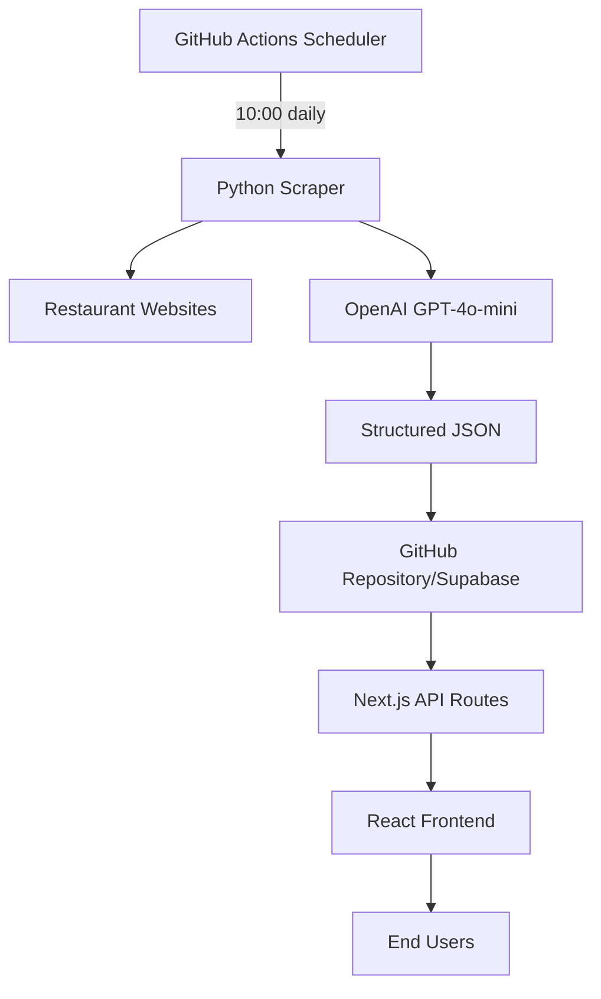

# IST Lunch - Technical Specification

## Project Overview

**Project Name:** IST Lunch  
**Version:** 1.0.0  
**Target Market:** Sundbyberg, Stockholm, Sweden  
**Language:** Swedish (sv-SE)  
**Currency:** SEK  

### Executive Summary
IST Lunch is an automated lunch menu aggregator for restaurants within 20-minute walking distance of Sundbyberg Esplanaden 1. The system uses AI to analyze, categorize, and score menu items for health and dietary preferences.

## Core Requirements

### Functional Requirements

#### 1. Data Collection (P0)
- **FR1.1:** Scrape lunch menus from 10+ restaurant websites daily
- **FR1.2:** Support multiple data formats (HTML, PDF, images)
- **FR1.3:** Handle Swedish language content with proper encoding (UTF-8)
- **FR1.4:** Fallback to cached data when scraping fails

#### 2. AI Analysis (P0)
- **FR2.1:** Extract dish names, descriptions, and prices from unstructured text
- **FR2.2:** Categorize dishes: Kött/Fisk/Vegetarisk/Vegansk/Övrigt
- **FR2.3:** Calculate health score (0-100) based on ingredients and preparation
- **FR2.4:** Identify dietary tags (high-protein, low-carb, gluten-free, etc.)
- **FR2.5:** Extract allergen information

#### 3. User Interface (P0)
- **FR3.1:** Display restaurants with today's menus
- **FR3.2:** Show distance and walking time from central location
- **FR3.3:** Filter by category, price, health score, dietary preferences
- **FR3.4:** Search by restaurant name or dish
- **FR3.5:** Responsive design for mobile and desktop

#### 4. Automation (P1)
- **FR4.1:** Auto-update menus weekdays at 10:00 Stockholm time
- **FR4.2:** Manual refresh button for immediate updates
- **FR4.3:** Admin interface to add/remove restaurants

### Non-Functional Requirements

#### Performance
- **NFR1.1:** Page load time < 2 seconds
- **NFR1.2:** API response time < 400ms (p95)
- **NFR1.3:** Scraping completion < 5 minutes for all restaurants

#### Reliability
- **NFR2.1:** 99% uptime during lunch hours (10:00-14:00 weekdays)
- **NFR2.2:** Graceful degradation with cached data
- **NFR2.3:** Error logging and monitoring

#### Security
- **NFR3.1:** No storage of personal data
- **NFR3.2:** Secure API keys in environment variables
- **NFR3.3:** Rate limiting on API endpoints

#### Cost
- **NFR4.1:** Total monthly cost < 50 SEK
- **NFR4.2:** Scalable to 50 restaurants without cost increase
- **NFR4.3:** Hard spending limits on all external services

## Technical Architecture

### System Components



### Technology Stack

| Layer | Technology | Justification |
|-------|-----------|---------------|
| **Frontend** | Next.js 14, React 18, TypeScript | Modern, SEO-friendly, fast |
| **Styling** | Tailwind CSS | Rapid development, consistent design |
| **Backend** | Next.js API Routes | Serverless, integrated with frontend |
| **Scraping** | Python, Playwright, BeautifulSoup | Handles dynamic content, reliable |
| **AI** | OpenAI GPT-4o-mini | Cost-effective, Swedish language support |
| **Database** | GitHub (JSON) / Supabase | Free tier, simple structure |
| **Hosting** | Vercel | Free tier, automatic deploys |
| **Automation** | GitHub Actions | Free tier, integrated with repo |

### Data Models

#### Restaurant
```typescript
interface Restaurant {
  id: string;              // Unique identifier (kebab-case)
  name: string;            // Display name
  address: string;         // Street address
  url: string;            // Restaurant website
  lat?: number;           // Latitude
  lon?: number;           // Longitude
  distance_m?: number;    // Distance in meters
  walk_time_min?: number; // Walking time in minutes
}
```

#### MenuItem
```typescript
interface MenuItem {
  name: string;                    // Dish name
  description?: string;            // Description
  price: number | null;           // Price in SEK
  category: Category;             // Food category
  health_score: number;           // 0-100
  diet_tags: string[];           // ['high-protein', 'low-carb']
  allergens: string[];           // ['gluten', 'laktos']
  confidence?: number;           // AI confidence 0-1
}

type Category = 'Kött' | 'Fisk' | 'Vegetarisk' | 'Vegansk' | 'Övrigt';
```

#### MenuData
```typescript
interface MenuData {
  generated_at: string;    // ISO timestamp
  date: string;           // YYYY-MM-DD
  restaurants: Array<{
    ...Restaurant,
    menu_items: MenuItem[];
    scraped_at: string;
  }>;
}
```

## Implementation Plan

### Phase 1: MVP (Week 1)
- [x] Project setup and structure
- [ ] Basic scraper for 3 restaurants
- [ ] OpenAI integration
- [ ] Simple frontend display
- [ ] Deploy to Vercel

### Phase 2: Core Features (Week 2)
- [ ] Add 10+ restaurants
- [ ] Implement all filters
- [ ] Health score algorithm
- [ ] GitHub Actions automation
- [ ] Error handling and fallbacks

### Phase 3: Polish (Week 3)
- [ ] Design improvements
- [ ] Performance optimization
- [ ] Admin interface
- [ ] Documentation
- [ ] Testing

### Phase 4: Launch (Week 4)
- [ ] Beta testing with colleagues
- [ ] Bug fixes
- [ ] Marketing preparation
- [ ] Public launch

## API Specifications

### GET /api/menus
Returns today's menus for all restaurants.

**Response:**
```json
{
  "generated_at": "2024-01-24T10:15:00Z",
  "date": "2024-01-24",
  "restaurants": [
    {
      "id": "eatery-garden",
      "name": "Eatery Garden",
      "menu_items": [...],
      "distance_m": 350,
      "walk_time_min": 4
    }
  ]
}
```

### GET /api/restaurants
Returns list of all restaurants.

### POST /api/refresh
Triggers manual menu refresh (protected endpoint).

## Health Score Algorithm

### Calculation Method
```python
def calculate_health_score(item: dict) -> int:
    score = 50  # Base score
    
    # Positive factors
    if has_keywords(['sallad', 'grönsaker', 'råkost']):
        score += 10
    if has_keywords(['fisk', 'lax']) and not has_keywords(['friterad']):
        score += 8
    if has_keywords(['fullkorn', 'quinoa', 'bulgur']):
        score += 6
    if has_keywords(['ugns', 'ångkokt', 'kokt']):
        score += 4
    
    # Negative factors
    if has_keywords(['korv', 'bacon', 'fläsk']):
        score -= 10
    if has_keywords(['friterad', 'panerad']):
        score -= 8
    if has_keywords(['gräddsås', 'ostsås']):
        score -= 6
    
    return max(0, min(100, score))
```

## Cost Analysis

### Monthly Costs
| Service | Usage | Cost |
|---------|-------|------|
| OpenAI GPT-4o-mini | ~30,000 tokens/day | 15 SEK |
| Vercel | <100GB bandwidth | 0 SEK |
| GitHub Actions | <2000 minutes | 0 SEK |
| Supabase | <500MB | 0 SEK |
| **Total** | | **15 SEK** |

### Cost Optimization
1. Cache AI responses for identical menu texts
2. Use GitHub as database (no Supabase needed)
3. Optimize image sizes
4. Implement CDN caching

## Testing Strategy

### Unit Tests
- Menu parser functions
- Health score calculator
- Category classifier
- Price extractor

### Integration Tests
- Scraper → AI → Database flow
- API endpoints
- Frontend filters

### E2E Tests
- User journey: Find vegetarian lunch under 140 SEK
- Admin: Add new restaurant
- Mobile responsiveness

## Deployment

### Environment Variables
```env
# Required
OPENAI_API_KEY=sk-...

# Optional
SUPABASE_URL=https://...
SUPABASE_ANON_KEY=eyJ...
NEXT_PUBLIC_SITE_URL=https://ist-lunch.vercel.app
```

### CI/CD Pipeline
1. Push to main branch
2. GitHub Actions runs tests
3. Vercel auto-deploys frontend
4. GitHub Actions runs scraper (scheduled)

## Monitoring & Analytics

### Key Metrics
- Daily active users
- Most popular filters
- Restaurant coverage
- Scraping success rate
- AI token usage

### Error Tracking
- Sentry for frontend errors
- GitHub Actions logs for scraper
- OpenAI usage dashboard

## Legal & Compliance

### GDPR
- No personal data collection
- No cookies requiring consent
- Privacy policy page

### Web Scraping
- Respect robots.txt
- Add delays between requests
- Identify bot in User-Agent
- Cache aggressively

## Future Enhancements

### Version 1.1
- User accounts and favorites
- Restaurant ratings
- Push notifications
- Email digest

### Version 2.0
- Restaurant partnerships
- Booking integration
- Loyalty program
- Mobile app

## Success Criteria

### Launch Metrics
- 10+ restaurants with daily updates
- <2 second load time
- 95% scraping success rate
- <20 SEK monthly cost

### User Metrics (Month 1)
- 100+ daily active users
- 50+ returning users
- 4.0+ user satisfaction
- 5+ partner restaurants

## Risk Mitigation

| Risk | Impact | Mitigation |
|------|--------|------------|
| Websites block scraping | High | Multiple scraping methods, manual fallback |
| AI costs exceed budget | Medium | Hard limits, caching, fallback to regex |
| Restaurant changes format | Medium | Flexible parsers, error notifications |
| Low user adoption | High | Marketing plan, SEO optimization |

## Appendix

### Restaurant List
1. Eatery Garden Sundbyberg
2. Ristorante Parma
3. A la Chino
4. Acapulco
5. Al Tonno
6. Affogato
7. Al Capone
8. Kitchin by Kasai
9. Mondo Pazzo
10. Piatti

### Swedish Food Vocabulary
- Kött: kyckling, nöt, fläsk, lamm, kalv
- Fisk: lax, torsk, sill, räkor, skaldjur
- Vegetarisk: ost, ägg, halloumi
- Vegansk: växtbaserad, soja, tofu
- Tillagning: stekt, kokt, ugns, friterad, ångad