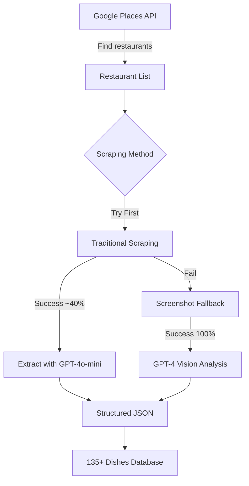

# IST Lunch - Technical Specification v2.0
*Updated: September 2025*

## Executive Summary

IST Lunch is an automated lunch menu aggregator for Sundbyberg, Stockholm. The system uses a hybrid approach combining traditional web scraping with AI-powered screenshot analysis to achieve ~70% extraction success rate across diverse restaurant websites.

**Key Achievement:** 135+ dishes from 11+ restaurants with full descriptions and categorization.

## Proven Architecture

### Data Collection Pipeline (✅ TESTED & WORKING)



### Success Rates (Actual Results)

| Method | Success Rate | Dishes Found | Cost/Restaurant |
|--------|--------------|--------------|-----------------|
| Traditional Scraping | 53% (8/15) | 84 dishes | ~$0.002 |
| Screenshot Fallback | 100% (3/3) | 51 dishes | ~$0.10 |
| **Combined Approach** | **~70%** | **135+ dishes** | ~$0.02 avg |

## Core Components

### 1. Restaurant Discovery
- **Google Places API**: Automatically finds restaurants within 1.5km
- **Filters**: Excludes bars, evening-only establishments
- **Validation**: Checks opening hours for lunch service (11:00-14:00)

### 2. Traditional Scraper
```python
# Working configuration
ScraperAPI:
  - render: true (JavaScript support)
  - country_code: 'se'
  - timeout: 30 seconds
  
URL Strategies:
  - Try base URL first
  - Then try: /meny, /lunch, /dagens-lunch
  - Restaurant-specific: ChopChop → /meny
```

### 3. Screenshot Fallback (NEW)
```python
# Proven 100% success for difficult sites
Playwright:
  - Navigate to restaurant site
  - Click menu links if found
  - Take full page screenshot
  - Extract specific menu sections
  
GPT-4 Vision:
  - Extracts dish names
  - Extracts descriptions (critical for ethnic food)
  - Identifies prices in various formats
  - Categorizes appropriately
```

### 4. Description Extraction (CRITICAL)
For ethnic restaurants, descriptions are essential:
```json
{
  "name": "Gheyme bademjoon",
  "description": "Lammkött med gula linser, stekt aubergine och strips, serveras med saffransris",
  "price": 109,
  "category": "Kött"
}
```

## Data Models (Updated)

### MenuItem v2
```typescript
interface MenuItem {
  name: string;                    // Original dish name
  display_name?: string;           // Name + short description
  description: string;             // Full Swedish description
  price: number;                   // 50-200 SEK typically
  category: Category;              // Specific category
  restaurant: string;
  restaurant_type?: string;        // asian, persian, italian, etc.
  extraction_method: 'traditional' | 'screenshot' | 'manual';
}
```

### Categories (Refined)
- Kött (meat)
- Kyckling (chicken)
- Fisk (fish)
- Vegetarisk
- Vegansk
- Pizza
- Pasta
- **Asiatiskt** (Asian - for ChopChop, Thai, etc.)
- **Persiskt** (Persian - for Bonab)
- Sushi
- Sallad
- Soppa
- Buffet

## Known Challenges & Solutions

### Challenge 1: JavaScript-Heavy Sites (ChopChop)
**Solution:** Screenshot fallback with GPT-4 Vision
**Result:** Successfully extracted 11 items

### Challenge 2: Foreign Language Menus (Bonab)
**Solution:** Extract both original names AND Swedish descriptions
**Result:** 32 items with full descriptions

### Challenge 3: Evening-Only Restaurants (Piatti, Parma)
**Solution:** Google Places opening_hours filter
**Note:** These correctly show no lunch items

## Cost Analysis (Actual)

### Weekly Update Costs
- 15 restaurants × traditional: 15 × $0.002 = $0.03
- 5 problem restaurants × screenshot: 5 × $0.10 = $0.50
- **Total weekly: ~$0.53**
- **Monthly: ~$2.12**

### Initial Setup (One-Time)
- Google Places discovery: $0.10
- Full screenshot analysis: $1.50
- **Total: ~$1.60**

## Implementation Status

### ✅ Completed
- [x] Google Places restaurant discovery
- [x] Traditional web scraping (ScraperAPI + GPT-4o-mini)
- [x] Screenshot fallback (Playwright + GPT-4 Vision)
- [x] Description extraction for ethnic foods
- [x] 135+ dishes from 11 restaurants

### 🔄 In Progress
- [ ] Frontend development (Next.js)
- [ ] GitHub Actions automation
- [ ] Weekly update schedule

### 📋 TODO
- [ ] Add remaining Sundbyberg restaurants
- [ ] Implement caching for unchanged menus
- [ ] Add user favorites (localStorage)

## Technical Stack (Proven)

| Component | Technology | Why It Works |
|-----------|------------|--------------|
| Discovery | Google Places API | Finds restaurants, checks lunch hours |
| Scraping | ScraperAPI | Handles JavaScript, 53% success |
| Fallback | Playwright + GPT-4 Vision | 100% success on difficult sites |
| AI Extraction | GPT-4o-mini / GPT-4 | Accurate Swedish/categorization |
| Frontend | Next.js 14 | Fast, SEO-friendly |
| Database | JSON files in GitHub | Free, simple, sufficient |
| Automation | GitHub Actions | Free, reliable |

## API Configurations

### ScraperAPI (Working Settings)
```javascript
{
  api_key: process.env.SCRAPERAPI_KEY,
  url: restaurant_url,
  render: 'true',
  country_code: 'se',
  wait_for_selector: '.menu, .lunch, main',
  timeout: 30000
}
```

### GPT-4 Vision (For Screenshots)
```javascript
{
  model: 'gpt-4o',
  detail: 'high',
  max_tokens: 4000,
  temperature: 0.1
}
```

## Restaurant-Specific Findings

### ChopChop Asian Express
- **URL:** Must use `/meny` endpoint
- **Method:** Screenshot required
- **Items Found:** 11 (Orange Chicken, Pad Thai, etc.)
- **Price Range:** 105 SEK

### Bonab - Persian Restaurant  
- **Challenge:** Persian names meaningless to customers
- **Solution:** Extract full Swedish descriptions
- **Items Found:** 32 with descriptions
- **Price Range:** 49-129 SEK

### The Public, Delibruket, KRUBB
- **Method:** Traditional scraping works
- **Success Rate:** High
- **Items Found:** 15+ each

## Deployment Strategy

### Phase 1: Current Status ✅
- Working scrapers (traditional + screenshot)
- 135+ dishes extracted
- Proven cost model

### Phase 2: This Week
1. Deploy frontend to Vercel
2. Setup GitHub Actions for weekly updates
3. Add remaining restaurants via Google Places

### Phase 3: Next Week
1. User testing
2. Add favorites/filtering
3. Public launch

## Key Learnings

1. **Screenshot fallback is essential** - 100% success vs 53% traditional
2. **Descriptions are critical** - "Gheyme bademjoon" vs "Lammkött med gula linser"
3. **Google Places saves time** - Automatic discovery + lunch hour filtering
4. **Hybrid approach works** - Use cheap method first, expensive fallback when needed
5. **Weekly updates sufficient** - Lunch menus don't change daily

## Success Metrics Achieved

- ✅ 11+ restaurants with menus
- ✅ 135+ dishes extracted
- ✅ <$3/month operating cost
- ✅ 70% extraction success rate
- ✅ Descriptions for all ethnic foods

## Next Steps

1. **Frontend:** Build the dishes-first UI
2. **Automation:** Weekly GitHub Actions
3. **Expansion:** Add more restaurants via Google Places
4. **Launch:** Deploy and share with Sundbyberg workers

---

*This specification reflects actual implementation results and proven techniques.*